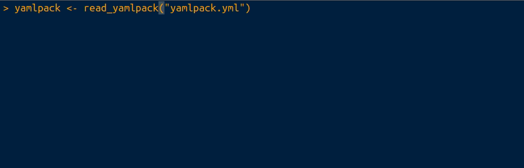
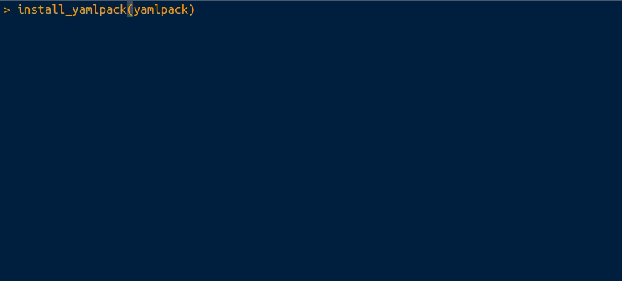

<!-- README.md is generated from README.Rmd. Please edit that file -->

```{r, include = FALSE}
knitr::opts_chunk$set(
  collapse = TRUE,
  comment = "#>",
  fig.path = "man/figures/README-",
  out.width = "100%"
)
```

# yamlpack

<!-- badges: start -->
<!-- badges: end -->

Yamlpack allows all currently installed R packages and their sources to be stored to and restored from a YAML file.  

Intended uses include building docker images, installing packages en-masse, or re-installing R after a major revision (e.g. 3.6.3->4.0.0).  The default parameters use **pak** for fast, parallelized installation of packages (https://github.com/r-lib/pak).

For fine-grained version control of packages and maximum reproducibility, you probably want the excellent **renv** package (https://github.com/rstudio/renv/) instead.

## Installation

You can install the development version from: -

``` r
# install.packages("devtools")
devtools::install_github("combiz/yamlpack")
```

## Example

The complete set of package names and sources currently installed can be written to a YAML file using `write_yamlpack()`: -

```{r write_example, eval = FALSE}
library(yamlpack)
write_yamlpack("yamlpack.yml")
```


A YAML file previously saved with `write_yamlpack()` can be read using `read_yamlpack()`: -

```{r read_example, eval = FALSE}
yamlpack <- read_yamlpack("yamlpack.yml")
```



Packages in a yamlpack object read in using `write_yamlpack()` can be installed using `install_yamlpack()`: -

```{r install_example, eval = FALSE}
install_yamlpack(yamlpack)
```


